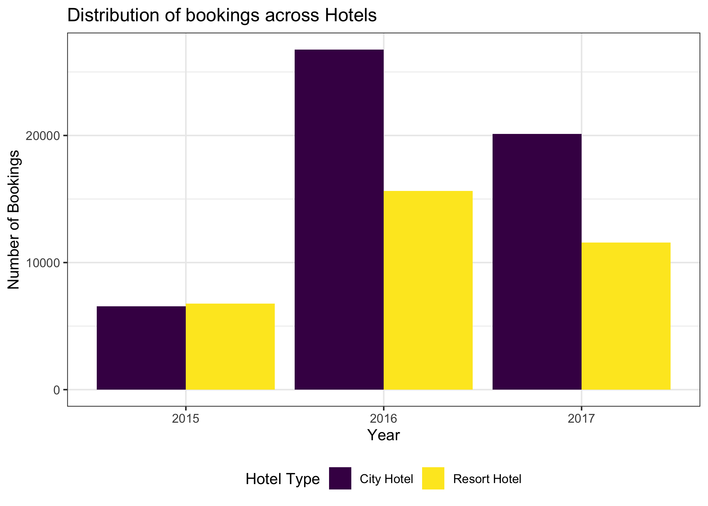
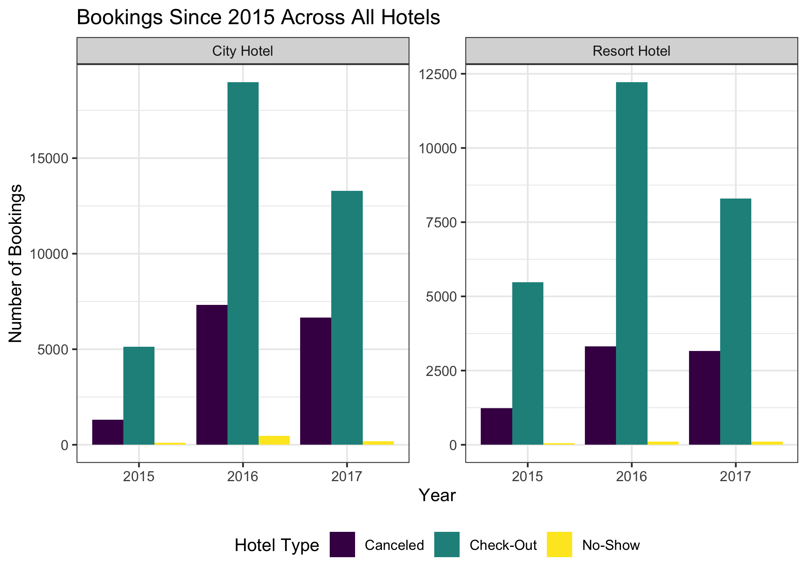
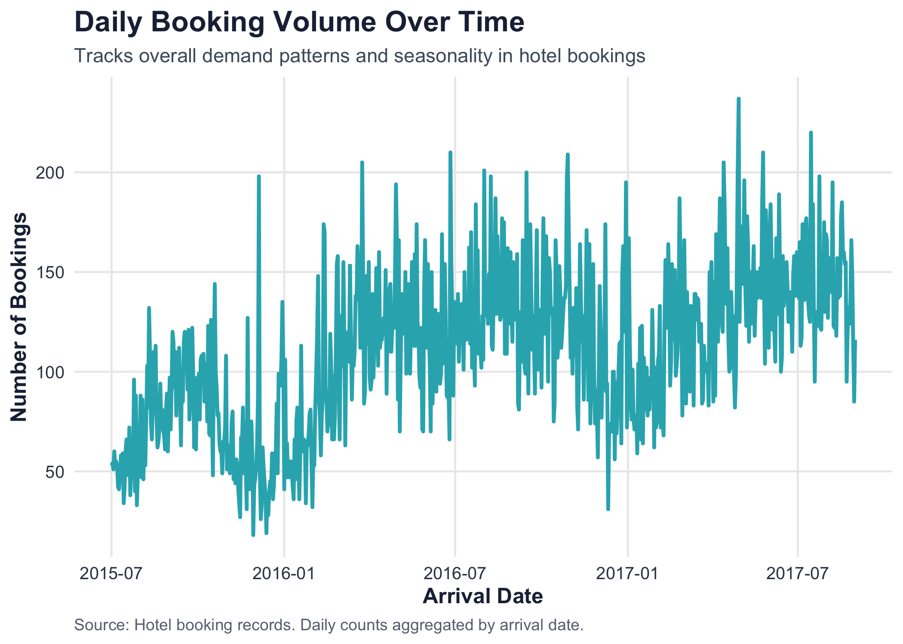
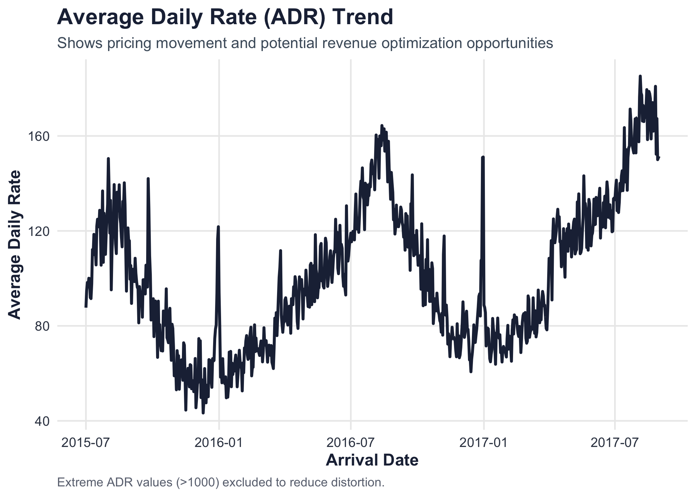
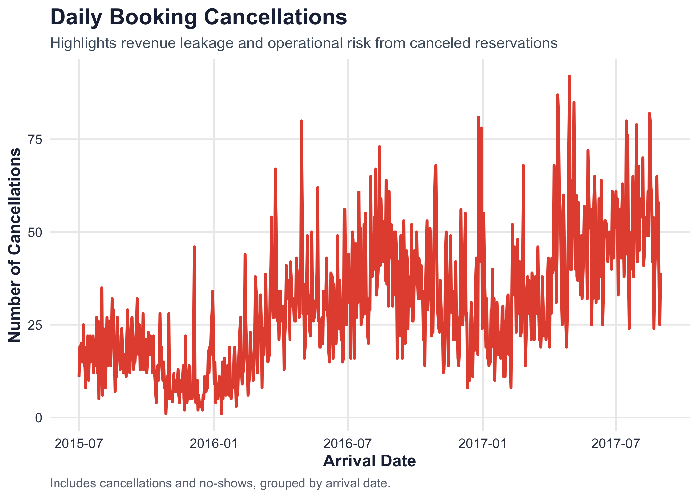

Exploratory Data Analysis
================
Eugene Kiepeeh
2026-08-21

Load clean hotel booking data

``` r
final_hotel_bookings <- read_csv("~/Documents/00 Working Projects/Hotel Data Analytics/Hotel Analytics/Data/Processed_Data/final_hotel_bookings.csv")
```

Create Visualization theme for business level plots

``` r
final_hotel_bookings |>
  mutate(arrival_date_year = as.factor(arrival_date_year)) |>
  ggplot(aes(x = arrival_date_year, fill = hotel)) +
  geom_bar(position = "dodge") +
  labs(title = "Distribution of bookings across Hotels",
       x = "Year",
       y = "Number of Bookings",
       fill = "Hotel Type") +
  scale_fill_ordinal() +
  theme_bw() +
  theme(legend.position = "bottom")
```

<!-- -->

``` r
final_hotel_bookings |>
  mutate(arrival_date_year = as.factor(arrival_date_year)) |>
  ggplot(aes(x = arrival_date_year, fill = reservation_status)) +
  geom_bar(position = "dodge") +
  labs(title = "Bookings Since 2015 Across All Hotels",
       x = "Year",
       y = "Number of Bookings",
       fill = "Hotel Type") +
  scale_fill_ordinal() +
  facet_wrap(~hotel, scale = "free") +
  theme_bw() +
  theme(legend.position = "bottom")
```

<!-- -->

—- Exploring Daily Bookings —-

``` r
final_hotel_bookings |>
  count(arrival_date) |>
  ggplot(aes(x = arrival_date, y = n)) +
  geom_line(color = "#2CB1BC", linewidth = 1) +
  labs(
    title = "Daily Booking Volume Over Time",
    subtitle = "Tracks overall demand patterns and seasonality in hotel bookings",
    x = "Arrival Date",
    y = "Number of Bookings",
    caption = "Source: Hotel booking records. Daily counts aggregated by arrival date."
  ) +
  theme_business()
```

<!-- -->

``` r
final_hotel_bookings |> filter(adr < 1000) |>
  group_by(arrival_date) |>
  summarise(avgPrice = mean(adr, na.rm = TRUE), .groups = "drop") |>
  ggplot(aes(x = arrival_date, y = avgPrice)) +
  geom_line(color = "#1F2A44", linewidth = 1) +
  labs(
    title = "Average Daily Rate (ADR) Trend",
    subtitle = "Shows pricing movement and potential revenue optimization opportunities",
    x = "Arrival Date",
    y = "Average Daily Rate",
    caption = "Extreme ADR values (>1000) excluded to reduce distortion."
  ) +
  theme_business()
```

<!-- -->

``` r
final_hotel_bookings |>
  mutate(reservation_status = fct_recode(reservation_status, "Canceled" = "No-Show")) |>
  count(arrival_date, reservation_status) |>
  filter(reservation_status == "Canceled") |>
  ggplot(aes(x = arrival_date, y = n)) +
  geom_line() +
  geom_line(color = "#E5533D", linewidth = 1) +
  labs(
    title = "Daily Booking Cancellations",
    subtitle = "Highlights revenue leakage and operational risk from canceled reservations",
    x = "Arrival Date",
    y = "Number of Cancellations",
    caption = "Includes cancellations and no-shows, grouped by arrival date."
  ) +
  theme_business()
```

<!-- -->
