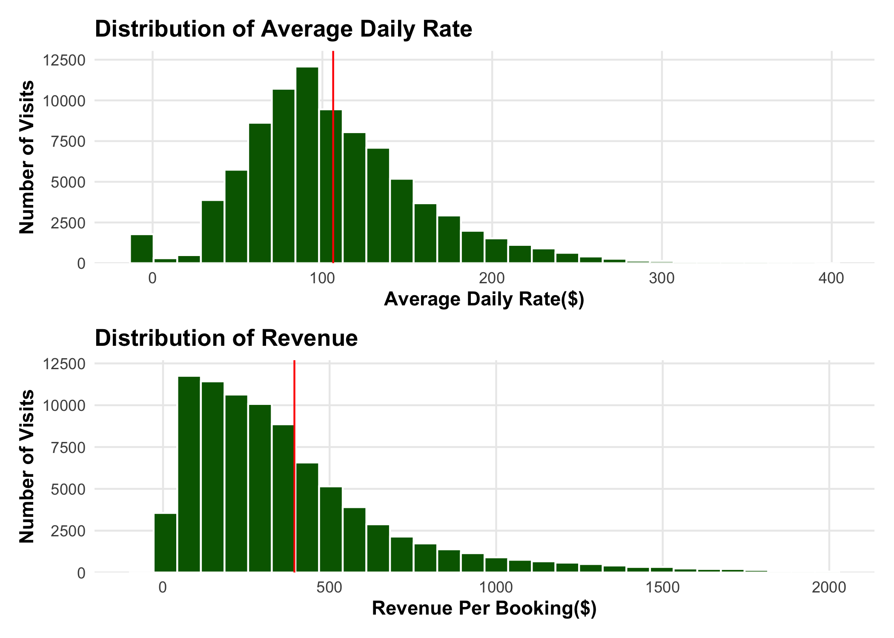
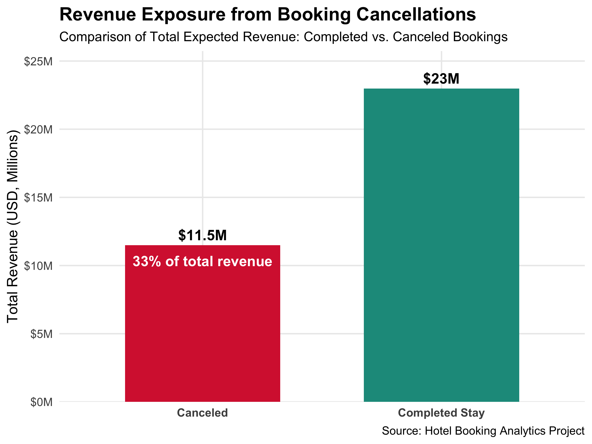
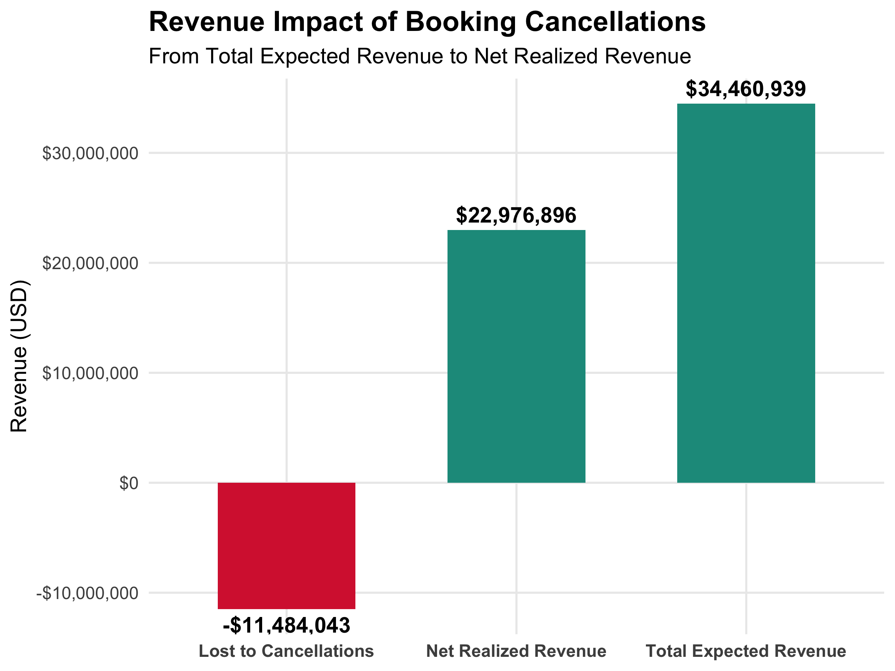

Analyzing Average Daily Rate
================
Eugene Kiepeeh
2026-08-21

``` r
final_hotel_bookings <- read_csv("~/Documents/00 Working Projects/Hotel Data Analytics/Hotel Analytics/Data/Processed_Data/final_hotel_bookings.csv")

theme_business <- function() {
  theme_minimal(base_size = 12) +
  theme(
    plot.title = element_text(face = "bold", size = 16, color = "#1F2A44"),
    plot.subtitle = element_text(size = 11, color = "#4E5D6C"),
    plot.caption = element_text(size = 9, color = "#6B7280", hjust = 0),
    axis.title = element_text(face = "bold", color = "#1F2A44"),
    axis.text = element_text(color = "#374151"),
    panel.grid.minor = element_blank()
  )
}
```

Summary Statistics

``` r
summary(final_hotel_bookings$revenue)
```

    ##    Min. 1st Qu.  Median    Mean 3rd Qu.    Max. 
    ##   -63.8   152.5   299.0   394.3   503.2  7590.0

``` r
sum_revenue <- sum(final_hotel_bookings$revenue)

final_hotel_bookings |>
  group_by(reservation_status) |>
  summarise(num = n(),
    totalRevenue = sum(revenue, na.rm = T),
            AvgADR = mean(adr, na.rm = T), 
    .groups = "drop") |>
  mutate(propTotalRevenue = totalRevenue/sum_revenue)
```

    ## # A tibble: 3 × 5
    ##   reservation_status   num totalRevenue AvgADR propTotalRevenue
    ##   <chr>              <int>        <dbl>  <dbl>            <dbl>
    ## 1 Canceled           23011    11075873.  119.            0.321 
    ## 2 Check-Out          63371    22976896.  102.            0.667 
    ## 3 No-Show             1014      408170.   99.4           0.0118

``` r
p1 <- final_hotel_bookings |>
  filter(adr < 400) |>
  ggplot(aes(x = adr)) +
           geom_histogram(fill = "darkgreen", color = "White", bins = 30) +
           geom_vline(xintercept = mean(final_hotel_bookings$adr), 
                      color = "red") +
  scale_y_continuous(expand = expansion(mult = c(0.0,0.08))) +
  theme_minimal() +
  theme(panel.grid.minor = element_blank(),
        title = element_text(face = "bold")) +
  labs(title = "Distribution of Average Daily Rate",
       x = "Average Daily Rate($)",
       y = "Number of Visits")
 
p2 <- final_hotel_bookings |>
  filter(revenue <2000) |>
  ggplot(aes(x = revenue)) +
           geom_histogram(fill = "darkgreen", color = "White", bins = 30) +
           geom_vline(xintercept = mean(final_hotel_bookings$revenue), color = "red") +
  scale_y_continuous(expand = expansion(mult = c(0.0,0.08))) +
  theme_minimal() +
  theme(panel.grid.minor = element_blank(),
        title = element_text(face = "bold")) +
  labs(title = "Distribution of Revenue",
       x = "Revenue Per Booking($)",
       y = "Number of Visits")

p1 + p2 + plot_layout(nrow = 2)
```

<!-- -->

``` r
final_hotel_bookings |>
  filter(revenue <2000) |>
  ggplot(aes(x = revenue)) +
  geom_histogram(bins = 30, fill = "darkgreen", color = "white") +
  scale_x_continuous(labels = dollar_format(), expand = expansion(mult = c(0.0,0.05))) +
  theme_business() +
  #theme(panel.grid.minor = element_blank(), title = element_text(face = "bold")) +
  labs(title = "Expected Revenue Distribution Per Booking (July 2015 - Aug 2017)", 
       x = "Revenue (USD)",
       y = "Number of Bookings")
```

<!-- -->

``` r
summary_data <- final_hotel_bookings |>
  group_by(is_canceled) |>
  summarise(num = n(),
    totalRevenue = sum(revenue, na.rm = T),
            AvgADR = mean(adr, na.rm = T)) |>
  mutate(is_canceled = fct_relevel(as.factor(is_canceled), "1","0"),
         is_canceled = fct_recode(is_canceled, "Canceled" = "1", "Completed Stay" = "0")) |>
  mutate(share = totalRevenue / sum(totalRevenue))
```

``` r
summary_data |>
  ggplot(aes(x = is_canceled, y = totalRevenue/1e6, fill = is_canceled)) +
  geom_col(width = 0.65, show.legend = FALSE) +
  geom_text(aes(label = paste0("$", round(totalRevenue/1e6,1), "M")),
            vjust = -0.5,
            fontface = "bold",
            size = 5) +
  geom_text(data = summary_data |> filter(is_canceled == "Canceled"),
          aes(label = paste0(percent(share), " of total revenue")),
          vjust = 2, color = "white", fontface = "bold") +
  scale_fill_manual(values = c("Canceled" = "#D7263D", "Completed Stay" = "#1B998B")) +
  scale_y_continuous(labels = dollar_format(suffix = "M"), 
                     expand =  expansion(mult = c(0.0,0.12))) +
  labs(
    title = "Revenue Exposure from Booking Cancellations",
    subtitle = "Comparison of Total Expected Revenue: Completed vs. Canceled Bookings", x = NULL, y = "Total Revenue (USD, Millions)",
    caption = "Source: Hotel Booking Analytics Project") +
    theme_minimal(base_size = 14) +
  theme(
    plot.title = element_text(face = "bold", size = 18),
    plot.subtitle = element_text(size = 13),
    axis.text.x = element_text(face = "bold"),
    panel.grid.minor = element_blank())
```

<!-- -->

``` r
rev_at_risk <- summary_data |>
  filter(is_canceled == "Canceled") |>
  pull(totalRevenue)

ggplot(summary_data,
       aes(x = is_canceled, y = totalRevenue/1e6, fill = is_canceled)) +
  geom_col(width = 0.65, show.legend = FALSE) +
  geom_text(aes(label = paste0("$", round(totalRevenue/1e6,1), "M")),
            vjust = -0.6,
            fontface = "bold",
            size = 5) +
  geom_text(aes(label = paste0("Bookings: ", comma(num))),
            vjust = 2, color = "white", fontface = "bold", size = 4) +
  geom_text(aes(label = paste0("Avg ADR: ", dollar(round(AvgADR,0)))),
          vjust = 3.5, color = "white", fontface =  "bold", size = 4) +
  annotate("label", x = 1.5,
         y = max(summary_data$totalRevenue/1e6) * 1.15,
         label = paste0("Revenue at Risk: ",
                        dollar(rev_at_risk)), fill = "#FFF3CD", 
         color = "black",fontface = "bold", size = 5) +
  scale_fill_manual(values = c("Canceled" = "#D7263D",
    "Completed Stay" = "#1B998B")) +
  scale_y_continuous(labels = dollar_format(suffix = "M"), 
                     expand =  expansion(mult = c(0.0,0.12))) +
  labs(
    title = "Revenue Exposure from Booking Cancellations",
    subtitle = "Comparison of Total Expected Revenue: Completed vs. Canceled Bookings",
    x = NULL,
    y = "Total Revenue (USD, Millions)",
    caption = "Source: Hotel Booking Analytics Project") + 
  theme_minimal(base_size = 14) +
  theme(
    plot.title = element_text(face = "bold", size = 18),
    plot.subtitle = element_text(size = 13),
    axis.text.x = element_text(face = "bold"),
    panel.grid.minor = element_blank())
```

<!-- -->

``` r
waterfall_df <- summary_data |>
  summarise(
    Total_Expected = sum(totalRevenue),
    Lost_Cancellations = totalRevenue[is_canceled == "Canceled"],
    Realized_Revenue = totalRevenue[is_canceled == "Completed Stay"])

waterfall_plot_df <- data.frame(
  Stage = c("Total Expected Revenue",
            "Lost to Cancellations",
            "Net Realized Revenue"),
  Amount = c(waterfall_df$Total_Expected,
             -waterfall_df$Lost_Cancellations,
             waterfall_df$Realized_Revenue))

head(waterfall_df)
```

    ## # A tibble: 1 × 3
    ##   Total_Expected Lost_Cancellations Realized_Revenue
    ##            <dbl>              <dbl>            <dbl>
    ## 1      34460939.          11484043.        22976896.

``` r
head(waterfall_plot_df)
```

    ##                    Stage    Amount
    ## 1 Total Expected Revenue  34460939
    ## 2  Lost to Cancellations -11484043
    ## 3   Net Realized Revenue  22976896

``` r
ggplot(waterfall_plot_df,
       aes(x = Stage, y = Amount, fill = Amount > 0)) +
  geom_col(width = 0.6, show.legend = FALSE) +
  geom_text(aes(label = dollar(Amount)),
            vjust = ifelse(waterfall_plot_df$Amount > 0, -0.5, 1.5), 
            fontface = "bold") +
  scale_fill_manual(values = c("TRUE" = "#1B998B",
                               "FALSE" = "#D7263D")) +
  scale_y_continuous(labels = dollar_format()) +
  labs(
    title = "Revenue Impact of Booking Cancellations",
    subtitle = "From Total Expected Revenue to Net Realized Revenue",
    x = NULL, y = "Revenue (USD)") +
  theme_minimal(base_size = 14) +
  theme(
    plot.title = element_text(face = "bold", size = 18),
    axis.text.x = element_text(face = "bold"),
    panel.grid.minor = element_blank())
```

<!-- -->
